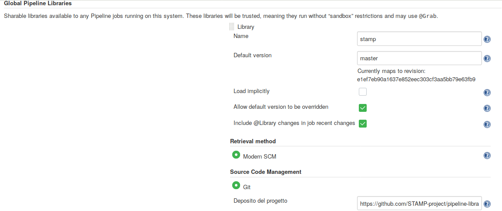

# STAMP CI/CD Cookbook
This cookbook is for developers, software architects, build managers and QA engineers who want to introduce STAMP test amplification within their CI/CD infrastructure.
A basic understanding of STAMP tools and Jenkins server configuration and usage is expected.

- STAMP tools
  - Assess your unit tests with [Descartes](https://github.com/STAMP-project/pitest-descartes) extreme mutation testing
  - Amplify your unit tests with [DSpot](https://github.com/stamp-project/dspot)
  - Amplify your test configurations with [CAMP](https://github.com/stamp-project/camp)
  - Reproduce automatically your production crashes with [Botsing](https://github.com/STAMP-project/botsing/)
- Jenkins
  - [Guided tour](https://jenkins.io/doc/pipeline/tour/getting-started/)
  - [Jenkins pipelines](https://jenkins.io/doc/book/pipeline/)
  - [Blue Ocean](https://jenkins.io/doc/book/blueocean/) Jenkins User Experience


## Table Of Content
- [Amplify unit tests bound to code changes](#amplify-on-code-changes)

## Amplify on code changes
This recipe explains how to use in a combined way [DSpot Diff Selector](https://github.com/STAMP-project/dspot/tree/master/dspot-diff-test-selection) (a tool able to select only unit tests related code changes) and DSpot itself to amplify just those selected unit tests within the CI, leveraging a Jenkins pipeline and [STAMP Pipeline Library](https://github.com/STAMP-project/pipeline-library).
### Getting ready
The pipeline we are going to setup has this structure:


After compilation and unit test steps, this pipeline will assess your test cases, then in "Amplify" step will retrieve all test cases related to code changes bound to current commit, and will amplify them. 

### How to do it
First of all you have to configure Jenkins to use STAMP pipeline code. You can configure it at global level or at build level. Following a screenshot that shows you how to configure it at global level:


 Then you have to configure the pipeline in your project repository

Following the pipeline code:

```
@Library('stamp') _

pipeline {
  agent any
  stages {
    stage('Compile') {
      steps {
        withMaven(maven: 'maven3', jdk: 'JDK8') {
          sh "mvn clean compile"
        }
      }
    }

   stage('Unit Test') {
      steps {
        withMaven(maven: 'maven3', jdk: 'JDK8') {
          sh "mvn test"
        }
      }
    }

    stage ('Test your tests'){
      steps {
        withMaven(maven: 'maven3', jdk: 'JDK8') {
          sh "mvn eu.stamp-project:pitmp-maven-plugin:1.3.6:descartes -DoutputFormats=HTML"
        }
         publishHTML (target: [
          allowMissing: false,
          alwaysLinkToLastBuild: false,
          keepAll: true,
          reportDir: 'target/pit-reports',
          reportFiles: '**/index.html',
          reportName: "Pit Decartes"
      ])
      }
    }

    stage('Amplify') {
      steps {
        script {
          stamp.cloneLastStableVersion("oldVersion")
            if (fileExists("${WORKSPACE}/oldVersion/src")){
              withMaven(maven: 'maven3', jdk: 'JDK8') {  
                sh "mvn clean eu.stamp-project:dspot-diff-test-selection:list -Dpath-dir-second-version=${WORKSPACE}/oldVersion"
                sh "mvn eu.stamp-project:dspot-maven:amplify-unit-tests -Dpath-to-test-list-csv=testsThatExecuteTheChange.csv -Dverbose -Dtest-criterion=ChangeDetectorSelector -Dpath-to-properties=tavern.properties -Damplifiers=NumberLiteralAmplifier -Diteration=2"
              }
            }
          }
        }
      }
    }
}
```

The first line imports STAMP Pipeline library.
The stage `Amplify` uses STAMP pipeline library to retrieve the diff cloning the previous last successfull build, and storing it in a folder. Then DSpot Diff Selector will use it to retrieve involved test cases, and then they will be passed to DSpot for the amplification.
